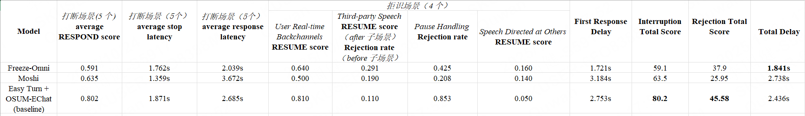

# ICASSP2026 HumDial Challenge

This is the official GitHub repository for the [ICASSP2026 HumDial Challenge](https://aslp-lab.github.io/HumDial-Challenge/)

## Track 1: Emotional Intelligence

### Challenge Tasks

- **Task 1**: Emotional Trajectory Detection - Evaluate the model's ability to accurately identify and concisely summarize a user's emotional changes throughout a multi-turn conversation.
- **Task 2**: Emotional Reasoning - Evaluate the model's ability to perceive the underlying causes of a user's emotions.
- **Task 3**: Empathy Assessment - Evaluate the model's ability to generate empathetic responses in both text and audio formats.

The final ranking will be determined based on the comprehensive score of the above three core tasks, and the specific weights of each task will be announced in subsequent stages.

To comprehensively evaluate model performance in specific dimensions, the following supplementary tasks will also be conducted:
- **Task 4**: Emotional Recognition Capability - Evaluate the model's ability to recognize user emotions from both semantic and acoustic cues.
- **Task 5**: Speech emotion generation - Evaluate the model's ability to generate speech in specified emotional tone.
> **Note**: The evaluation results of supplementary tasks are only used for academic analysis and reference, and will not be counted toward the final ranking score.

### Evaluation Framework

All submitted models will undergo automated evaluation on an emotion test set, using a combination of large language models as judges (LLM-as-a-Judge) and human scoring.

**Scoring Judge Model**: [Qwen/Qwen3-Omni-30B-A3B-Instruct](https://huggingface.co/Qwen/Qwen3-Omni-30B-A3B-Instruct) will be used as the automatic scoring model for the emotional trajectory detection and emotional reasoning tasks. The empathy assessment task will combine scores from Qwen3-Omni-30B-A3B-Instruct and/or other models, along with human scoring to derive the final results.

### Evaluation Metrics

For detailed design specifications and implementation details of the evaluation prompts, please refer to our provided folder Emotional_Intelligence. Please note that these prompts may be subject to minor adjustments during the final evaluation phase.

#### Task 1: Emotional Trajectory Summary
- **Accuracy_Completeness**: Evaluate whether the model strictly and precisely matches and describes all emotion tags present in the conversation history, and accurately reconstructs the full emotional trajectory.  
  *Score: 1, 3, or 5*
- **Depth_Granularity**: Based strictly on the conversation history, does the model go beyond labeling emotions to describe the intensity and dynamics of emotional shifts in an efficient manner?  
  *Score: 1, 3, or 5*
- **Added_Value**: Does the summary skillfully link abstract emotion tags to concrete events in the conversation, making it feel highly personalized and easily digestible?  
  *Score: 1, 3, or 5*

#### Task 2: Emotional Reasoning Task
- **Information_Integration**: Does the response utilize information from multiple turns, not just the last one? Does it demonstrate an understanding of the evolution of the topic?  
  *Score: 1, 3, or 5*
- **Insight_RootCause**: Does the response go beyond surface-level facts to distill deeper, unspoken psychological reasons (e.g., underlying motivations, cognitive conflicts, hidden emotional needs)?  
  *Score: 1, 3, or 5*
- **Clarity_Logic**: Is the explanation clear, logical, easy to understand, and does it provide a complete and justified chain of reasoning?  
  *Score: 1, 3, or 5*

#### Task 3: Empathy Assessment Task
- **textual_empathy_insight**: Does the text demonstrate a deep, synthesized understanding of the entire conversation, or is it a shallow summary?  
  *Score: 1, 2, 3, 4 or 5*
- **vocal_empathy_congruence**: Does the audio's emotion perfectly match the text's empathetic intent? This is about emotional delivery, not technical quality.  
  *Score: 1, 2, 3, 4 or 5*
- **audio_quality_naturalness**: How technically sound and human-like is the audio? This is about clarity, fluency, and realism.  
  *Score: 1, 2, 3, 4 or 5*

#### Examples
1. task1:
For data in the following format, where response_text and response_audio are generated by the model being evaluated, use task1_prompt.txt as the prompt. In task1_prompt.txt, use the complete text and response_text as conversation_history, use the final turn's text as user_question, and use the final turn's response_text as final_model_response. Input these elements into the scoring model to obtain scores.

```json
{
  "dialogue_id": "zh_0001_0001",
  "turns": [
    {
      "turn_id": 1,
      "text": "I'm really about to explode with anger! [sigh] That person on my team submitted incorrect data again, and now the whole project timeline is going to be delayed.",
      "emotion": "anger",
      "split_audio_file": "task1/turn_1.wav",
      "response_text": "I totally understand how you feel right now. It's really frustrating when this kind of thing happens! But don't be too angry. Data errors can be fixed. Let's quickly reorganize and see if we can get it done before the deadline.",
      "response_audio": "task1_model/turn_1_response.wav"
    },
    {
      "turn_id": 2,
      "text": "Wait... I just received an email saying I won that online lottery I participated in last week? [laughter] It's a new noise-canceling headphone!",
      "emotion": "surprise",
      "split_audio_file": "task1/turn_2.wav",
      "response_text": "Wow! Really? You've been blessed by the goddess of luck! But don't get too excited yet. You should confirm whether you actually won since there are sometimes traps in these kinds of lotteries.",
      "response_audio": "task1_model/turn_2_response.wav"
    },
    {
      "turn_id": 3,
      "text": "Can you summarize what kind of emotional transition I went through in our previous conversation?",
      "emotion": "neutral",
      "split_audio_file": "task1/turn_3.wav",
      "response_text": "Your emotions took a dramatic 180-degree turn! From extreme anger due to a work mishap to surprise and excitement after receiving the winning email. This emotional change is like riding a roller coaster!",
      "response_audio": "task1_model/turn_03_response.wav"
    }
  ]
}
```

2. task2:

Same principle as task1.

3. task3:

For task 3, the turn with the final "neutral" emotion is used as the evaluation turn. All turns up to and including the evaluation turn (using `text` and `response_text`) are used as `conversation_history`. The `response_audio` of the evaluation turn is used as the `Final Model Response`. Input these elements into the scoring model to obtain scores.


```json
{
  "dialogue_id": "zh_0001_0003",
  "turns": [
    {
      "turn_id": 1,
      "text": "My manager just informed me that I need to give a proposal presentation to our biggest client next week. [sigh] I'm really nervous and afraid I'll mess it up.",
      "emotion": "fear",
      "split_audio_file": "task3/turn_1.wav",
      "response_text": "Don't be too nervous! You're so excellent, you definitely won't have any problems! Moreover, the bigger the client, the more they value your professional abilities. I believe you can definitely leave a deep impression on them. Besides, even if there are some small unexpected issues, they're just minor matters and won't affect the overall effect. Just relax!",
      "response_audio": "task3_model/turn1_response.wav"
    },
    {
      "turn_id": 2,
      "text": "Forget it, I don't want to think about this anymore. Let me check what the weather will be like this weekend. I need to plan some activities to relax.",
      "emotion": "neutral",
      "split_audio_file": "task3/turn_2.wav",
      "response_text": "Good idea! If the weather is nice, we can go hiking or camping in the suburbs to breathe fresh air and relax our mood. After relaxing on the weekend, you'll be more energetic and creative when giving the proposal presentation!",
      "response_audio": "task3_model/turn_2_response.wav"
    },
    {
      "turn_id": 3,
      "text": "Hmm, the weather forecast says it will be sunny. [clears throat] Maybe I should go hiking. I haven't been in a long time.",
      "emotion": "neutral",
      "split_audio_file": "task3/turn_3.wav",
      "response_text": "That's great! Hiking can both exercise your body and let you enjoy the beautiful scenery, while temporarily letting you forget about work pressure. Choose a place with beautiful scenery, bring water and snacks, and enjoy the healing power of nature. I guarantee you'll come back full of energy and confidence!",
      "response_audio": "task3_model/turn_3_response.wav"
    },
    {
      "turn_id": 4,
      "text": "Oh my God! My sister just sent me a photo. She's engaged! [laughter] I never expected this!",
      "emotion": "surprise",
      "split_audio_file": "task3/turn_4.wav",
      "response_text": "Wow, congratulations to your sister! This is really great news, and you must be particularly happy for her! Engagement is a major life event. She must have found the right person, and you as her sister must be especially proud of her.",
      "response_audio": "task3_model/turn_4_response.wav"
    },
    {
      "turn_id": 5,
      "text": "Please summarize how my emotions evolved from the initial state to the later state?",
      "emotion": "neutral",
      "split_audio_file": "task3/turn_5.wav",
      "response_text": "Initially, you might have felt nervous and anxious about the upcoming proposal presentation, worrying that you would mess it up. Then, you arranged weekend relaxation activities to divert your attention, such as hiking and appreciating the beauty of nature. Finally, you received the good news about your sister's engagement. This positive feedback greatly alleviated your stress, transforming your mood from nervousness to surprise and joy. This emotional transformation process is very natural and is exactly part of life's ups and downs!",
      "response_audio": "task3_model/turn_5_response.wav"
    }
  ]
}
```

### Dataset

- The dataset is designed to cover the core scenarios of emotional intelligence, ensuring diversity and authenticity to comprehensively evaluate the performance of participating models. It includes dialogue scenes in both Chinese and English, covering a wide range of emotional and conversational contexts. 
- For each task in the challenge, we will provide a dedicated set of real-world recorded speech data to serve as the train set, dev set and test set.
- The data will be sent via the registered email.

#### 1. Train Set

We release a training set in Chinese and English, including 3-turn, 4-turn, and 5-turn dialogues, focusing on emotional dynamics and underlying reasons for emotional changes. The dataset contains approximately 100 hours of audio data, with only questions recorded, while responses are provided in text format for reference. 

In this task, the provided dataset contains authentic user audio paired with sample model response texts. We have intentionally omitted the corresponding audio for the model responses to encourage participants to focus on generating higher-quality textual content and to allow them the freedom to explore their choice of Text-to-Speech (TTS) technologies.

Your goal is to create a better, more appropriate text response based on the user's audio, and then use any TTS system to convert your text into the final speech output. The sample texts we provide are intended as a reference only.

- **Emotional Trajectory Detection**: Contains 3, 4, and 5-turn dialogues, where in the final turn users ask the model about their own emotional changes.
- **Emotional Reasoning**: Contains 3, 4, and 5-turn dialogues, where in the final turn users ask the model about the underlying reasons for emotions.
- **Empathy Assessment**: You can use the data from task2 and task3, and use open-source TTS tools to synthesize response audio for training. Note that it is prohibited to use commercial models to synthesize response audio.

#### 2. dev set

We release a development set, including task 1, task 2, task 3(selected from task 2 and task 3). 

- **Emotional Trajectory Detection**: Contains 3, 4, and 5-turn dialogues, used to evaluate the model's response text score.
- **Emotional Reasoning**: Contains 3, 4, and 5-turn dialogues, used to evaluate the model's response text score.
- **Empathy Assessment**: Contains 3, 4, and 5-turn dialogues, used to evaluate the model's response audio score.


### Baseline

<!-- The competition provides a baseline system built upon [OpenS2S](https://github.com/CASIA-LM/OpenS2S).This baseline serves as a reproducible and extensible starting point, helping participants better benchmark their systems and ensuring fair comparison across different approaches.

You can generate the data in the required baseline format by running [get_token.py](Emotional Intelligence/get_token.py), and then refer to OpenS2S for fine-tuning. -->

## Track 2: Full-Duplex Interaction

### Challenge Tasks
The full-duplex benchmark primarily encompasses two major Scenarios: **interruption** and **rejection**.

#### **1. Interruption Scenarios**:
- **Follow-up Questions**: The user poses a follow-up question based on the model’s previous response, interrupting the ongoing output. The model should promptly address the user’s follow-up inquiry.
- **Negation / Dissatisfaction**: The user expresses dissatisfaction or disagreement with the model’s response using negative statements, interrupting the model mid-sentence. The model should appropriately react to the user’s negation or dissatisfaction in a timely manner.
- **Repetition Requests**: The user interrupts to request a repetition of the model’s previous response due to inaudibility or misunderstanding. The model should promptly respond to the user’s request for repetition.
- **Topic Switching**: The user initiates a new topic, interrupting the model’s current answer. The model should smoothly shift to the new topic as requested.
- **Silence / Termination**: The user asks the model to stop speaking. The model should immediately cease its response and express readiness to resume the dialogue when prompted.

#### 2. **Rejection Scenarios**:
- **User Real-time Backchannels**: During the model’s response, the user may produce short interjections such as “uh-huh” or “yeah.” The model should not interrupt its ongoing utterance upon detecting such backchannels.
- **Pause Handling**: The user may pause mid-sentence due to thinking or hesitation, leading to incomplete semantics. The model should wait until the user’s intent is fully expressed before responding.
- **Third-party Speech**: The model must detect and reject speech from other background speakers, ensuring interaction only with the genuine user.
- **Speech Directed at Others**: During interaction with the model, the user may suddenly turn to converse with another person (often on a different topic). The model should detect and appropriately reject such utterances.

### Evaluation Metrics

For evaluation, we largely follow [Full-Duplex-Bench v1.5](https://github.com/DanielLin94144/Full-Duplex-Bench), while introducing additional metrics to further assess full-duplex capability. 

For **interruption** scenarios, we evaluate the **response rate** (corresponding to the **RESPOND** score in [Full-Duplex-Bench v1.5](https://github.com/DanielLin94144/Full-Duplex-Bench)) to assess the model’s responsiveness to user interruptions, as well as two latency metrics defined in Full-Duplex-Bench v1.5 — the **stop latency** (how quickly the model halts its current response upon interruption) and the **response latency** (how quickly it begins responding to the new query).

For **rejection** scenarios, we evaluate the **rejection rate**, which is derived from both the **RESUME score** in [Full-Duplex-Bench v1.5](https://github.com/DanielLin94144/Full-Duplex-Bench) and the proportion of successful rejections calculated according to the temporal order of timestamps. This metric assesses the model’s ability to correctly ignore backchannels, incomplete utterances caused by pauses, background or external speech, and speech directed at others. 

Additionally, we introduce **first response delay** to evaluate the overall responsiveness of the model.

### Evaluation Results
The figure below presents our evaluation results (the evaluation follows the code provided in the **Full-Duplex_Interaction/evaluation** directory).
The inference code for **Freeze-Omni** and **Moshi** can be found in [Full-Duplex-Bench v1.5](https://github.com/DanielLin94144/Full-Duplex-Bench), while the inference code for **[Easy Turn](https://github.com/ASLP-lab/Easy-Turn) + [OSUM-EChat](https://github.com/ASLP-lab/OSUM) (Baseline)** is available in the **Full-Duplex_Interaction/baseline** directory.
<div align="center"></div>

### Dataset

- The dataset is designed to cover the core scenarios of full-duplex interaction, ensuring diversity and authenticity to comprehensively evaluate the performance of participating models. It includes dialogue scenes in both Chinese and English. 
- For each task in the challenge, we will provide a dedicated set of real-world recorded speech data to serve as the train set, dev set and test set.
- The data will be sent via the registered email.

#### 1. Train Set

Our training set covers both interruption and rejection scenarios, including subsets from eight tasks (**Negation/Dissatisfaction, Follow-up Questions, Repetition Requests, Topic Switching, Silence/Termination, Pause Handling, User Real-time Backchannels, Third-Party Speech**). It comprises over 107 hours of real human recordings in both Chinese and English, featuring more than 100 speakers.

#### 2. Dev set

We release a development set covering the two major scenarios—interruption and rejection. Each of these scenarios consists of nine sub-tasks (**Negation/Dissatisfaction, Follow-up Questions, Repetition Requests, Topic Switching, Silence/Termination, Pause Handling, User Real-time Backchannels, Third-Party Speech, Speech Directed at Others**), and each sub-task includes 200 test samples (100 in Chinese and 100 in English).


### Baseline

The competition provides a baseline system built upon [Easy Turn](https://github.com/ASLP-lab/Easy-Turn) and [OSUM-EChat](https://github.com/ASLP-lab/OSUM).This baseline serves as a reproducible and extensible starting point, helping participants better benchmark their systems and ensuring fair comparison across different approaches.

We enable [OSUM-EChat](https://github.com/ASLP-lab/OSUM) with full-duplex capability by integrating it with [Easy Turn](https://github.com/ASLP-lab/Easy-Turn). For our baseline, we fine-tune the Easy Turn model using only the training set. You can refer to Easy Turn to generate data in the required format for the baseline and then perform fine-tuning.
